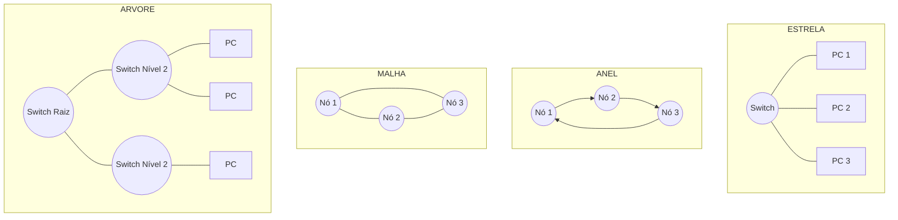

# 2. ARQUITETURA E TOPOLOGIAS DE REDES

## 2.1 ÁREA DE ABRANGÊNCIA (PAN, LAN, MAN, WAN, SAN)

**O QUE SIGNIFICA "ÁREA DE ABRANGÊNCIA"?**
Refere-se à extensão geográfica que uma rede cobre. Classificamos as redes pelo tamanho, velocidade e propósito, da menor escala pessoal até a escala global.

> 💡 **ANALOGIA DO MUNDO REAL:** Pense nos tipos de vias de transporte. Uma ciclovia (PAN) serve apenas você. As ruas do seu bairro (LAN) conectam sua casa aos vizinhos. As avenidas da cidade (MAN) ligam bairros distantes. As rodovias interestaduais (WAN) conectam cidades e países.

| TIPO DE REDE | SIGLA (INGLÊS) | DEFINIÇÃO TÉCNICA | EXEMPLO PRÁTICO |
| :--- | :--- | :--- | :--- |
| **REDE DE ÁREA PESSOAL** | **PAN** (*Personal Area Network*) | Rede de curtíssima distância (até ~10 metros), centrada em um único usuário para conectar dispositivos pessoais. | Bluetooth conectando seu smartphone ao fone de ouvido ou smartwatch. |
| **REDE LOCAL** | **LAN** (*Local Area Network*) | Rede que abrange uma área geográfica limitada, como uma residência, um escritório ou um prédio. Alta velocidade e propriedade privada. | A rede Wi-Fi ou cabeada da sua casa ou do escritório da sua empresa. |
| **REDE METROPOLITANA** | **MAN** (*Metropolitan Area Network*) | Rede que cobre uma cidade ou uma grande área metropolitana. Geralmente interconecta várias LANs. | A rede de fibra óptica que interliga todas as agências de um banco dentro de uma mesma cidade. |
| **REDE DE LONGA DISTÂNCIA** | **WAN** (*Wide Area Network*) | Rede que cobre uma grande área geográfica (países, continentes). A internet é a maior WAN do mundo. | A conexão que permite que uma matriz em São Paulo se comunique com uma filial em Tóquio. |
| **REDE DE ARMAZENAMENTO** | **SAN** (*Storage Area Network*) | *Caso especial:* Rede de alta velocidade dedicada exclusivamente a conectar servidores a dispositivos de armazenamento de dados (discos, fitas). | Um data center onde vários servidores acessam um enorme "pool" de discos rígidos como se fosse um disco local. |

---

## 2.2 TOPOLOGIAS DE REDES (FÍSICA VS. LÓGICA)

**DIFERENÇA ENTRE TOPOLOGIA FÍSICA E LÓGICA**
- **Topologia Física:** É o layout *real*, tangível. Mostra como os cabos estão passados e onde os dispositivos estão plugados.
- **Topologia Lógica:** É o caminho que os *dados realmente percorrem* na rede, independente de como os cabos estão fisicamente organizados.

**PRINCIPAIS TOPOLOGIAS FÍSICAS**

1. **BARRAMENTO:** Todos os dispositivos compartilham um único cabo central (backbone). 
   - *Analogia:* Um **ônibus em uma estrada de mão única**. Todos os dados passam pelo mesmo cabo; cada dispositivo "ouve" a passagem, mas só aceita o que é endereçado a ele.
2. **ESTRELA:** Todos os dispositivos se conectam a um ponto central (Switch ou Hub). 
   - *Analogia:* O **hub de um aeroporto**. Todos os voos (dados) passam pelo centro de controle antes de irem para o destino final. É a mais usada em LANs modernas.
3. **ANEL:** Os dispositivos formam um círculo fechado, onde cada nó se conecta a exatamente dois vizinhos.
   - *Analogia:* Uma **corrente humana passando baldes de água**. Os dados viajam de nó em nó em uma única direção. Se um nó falha, o anel quebra (a menos que haja um anel duplo de redundância).
4. **MALHA (MESH):** Os dispositivos possuem múltiplas conexões entre si. Na malha completa, todos se conectam a todos.
   - *Analogia:* O **sistema de ruas de uma metrópole**. Se uma avenida está bloqueada, o tráfego é imediatamente desviado por rotas alternativas. Máxima confiabilidade.
5. **ÁRVORE (HIERÁRQUICA):** Uma extensão da topologia em estrela. Vários switches são conectados a um switch principal, formando uma estrutura de "árvore" ou pirâmide.
   - *Analogia:* O **organograma de uma grande empresa**. O CEO (switch principal) se conecta aos diretores (switches secundários), que se conectam aos gerentes e, por fim, aos funcionários (computadores).

> 💡 **VISUALIZAÇÃO DAS TOPOLOGIAS**
> *O diagrama Mermaid abaixo ilustra as formas. Se não renderizar, o diagrama em texto (ASCII) garante a compreensão.*

---

## 2.3 MODELOS DE ARQUITETURA (PONTO A PONTO VS. CLIENTE-SERVIDOR)

**O QUE É ARQUITETURA DE REDE?**
Refere-se à forma como os computadores interagem e compartilham recursos, definindo quem "pede" e quem "fornece" os dados.

**ARQUITETURA PONTO A PONTO (PEER-TO-PEER / P2P)**
- **Definição:** Não há um servidor central. Todos os computadores (nós) têm o mesmo status e podem atuar tanto como clientes quanto como servidores, compartilhando recursos diretamente entre si.
- **Analogia:** Um **jantar onde todos trazem um prato (potluck)**. Não há um cozinheiro chefe; cada pessoa é responsável por trazer sua própria comida e pode compartilhar com os outros.
- **Vantagem/Desvantagem:** Barata, fácil de configurar e sem ponto único de falha. Porém, torna-se caótica e insegura em redes com mais de 10-15 computadores, pois não há gerenciamento centralizado.

**ARQUITETURA CLIENTE-SERVIDOR**
- **Definição:** Existe uma divisão clara de papéis. Os **clientes** (computadores dos usuários) solicitam recursos ou serviços, e os **servidores** (computadores potentes e dedicados) atendem a essas solicitações.
- **Analogia:** Um **restaurante tradicional**. Os clientes (mesas) fazem os pedidos, e a cozinha (servidor) é a única responsável por preparar e entregar a comida. Os clientes não cozinham para os outros.
- **Vantagem/Desvantagem:** Altamente escalável, segura e fácil de gerenciar (backups, permissões). A desvantagem é o custo elevado do hardware do servidor e o fato de que, se o servidor cair, ninguém trabalha.

---

## 2.4 COMPONENTES DA REDE (SERVIDORES, CLIENTES, ESTAÇÕES DE TRABALHO)

Para que a arquitetura funcione, precisamos de hardware com papéis definidos:

1. **SERVIDOR:**
   - **Definição:** Computador de alto desempenho (muita RAM, processadores robustos, discos em RAID) configurado para fornecer serviços, recursos ou dados a outros computadores na rede.
   - **Exemplo:** Um servidor de arquivos, um servidor de e-mail ou um servidor web.
2. **CLIENTE:**
   - **Definição:** Qualquer dispositivo ou software que *solicita* um serviço ou recurso de um servidor. 
   - **Exemplo:** O navegador Chrome no seu notebook solicitando uma página web a um servidor na internet.
3. **ESTAÇÃO DE TRABALHO (WORKSTATION):**
   - **Definição:** Um computador de mesa (desktop) ou notebook de alto desempenho, usado por um profissional para tarefas que exigem muito processamento local (ex: edição de vídeo, engenharia, design). 
   - **Diferença para o Cliente:** Toda estação de trabalho atua como *cliente* na rede, mas o termo "workstation" destaca que a máquina é poderosa para processamento *local*, não dependendo apenas do servidor.

---

## 2.5 SERVIDOR DEDICADO VS. NÃO DEDICADO

Esta é uma distinção crucial no mundo corporativo, referente a como os recursos do hardware do servidor são utilizados.

**SERVIDOR DEDICADO**
- **Definição:** O computador é configurado e utilizado *exclusivamente* para fornecer serviços de rede. Nenhum usuário pode sentar nele para navegar na internet, editar textos ou jogar.
- **Analogia:** Um **motorista de aplicativo em tempo integral**. O carro e o tempo dele são 100% dedicados a levar passageiros. Ele não faz outras tarefas enquanto trabalha.
- **Vantagem:** Desempenho máximo, segurança elevada e estabilidade. É o padrão para empresas de médio e grande porte.

**SERVIDOR NÃO DEDICADO**
- **Definição:** O computador atua como servidor (compartilha arquivos, por exemplo), mas também é usado como uma estação de trabalho normal por um usuário para tarefas do dia a dia.
- **Analogia:** Uma **pessoa que trabalha de casa**. Ela atende reuniões pelo computador (função de servidor), mas ao mesmo tempo está lavando louça, cuidando dos filhos e assistindo TV (função de estação de trabalho).
- **Vantagem/Desvantagem:** Econômico para pequenos escritórios (pequenas empresas ou home offices). Porém, se o usuário abrir um jogo ou um programa pesado, o desempenho da rede para todos os outros cai drasticamente. Além disso, é um risco de segurança.

---

## 2.6 RESUMO

- **ÁREA DE ABRANGÊNCIA:** PAN (pessoal) < LAN (local) < MAN (metropolitana) < WAN (global). SAN é uma rede especializada em armazenamento.

- **TOPOLOGIA:** Física (cabos) vs. Lógica (fluxo de dados). A **Estrela** domina as LANs; a **Malha** garante a resistência da Internet.

- **ARQUITETURA:** **Ponto a Ponto** (todos são iguais, descentralizado) vs. **Cliente-Servidor** (papéis definidos, centralizado e seguro).

- **COMPONENTES:** O **Servidor** fornece, o **Cliente** pede, e a **Estação de Trabalho** é um computador potente focado em processamento local.

- **DEDICAÇÃO:** Servidores **Dedicados** só servem à rede (melhor desempenho). Servidores **Não Dedicados** acumulam funções (mais barato, mas menos estável).
