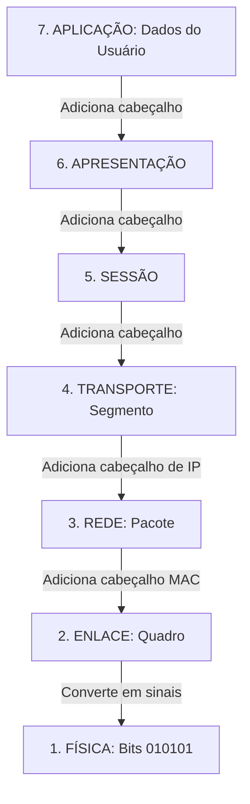

# 3. MODELOS DE REFERÊNCIA E PROTOCOLOS

## 3.1 VISÃO GERAL DE PROTOCOLOS

**O QUE É UM PROTOCOLO?**

Um protocolo é um conjunto formal de regras, convenções e estruturas de dados que governam como os dispositivos de uma rede se comunicam. Sem protocolos, os dispositivos seriam como pessoas falando idiomas diferentes em uma sala: haveria ruído, mas nenhuma comunicação real.
- **Analogia:** As **regras de etiqueta e gramática** de uma conversa. Para haver diálogo, é preciso saber quando falar, quando ouvir, em qual idioma falar e como se despedir.

**PADRÕES (STANDARDS)**

Para que um protocolo funcione globalmente, ele precisa ser um "padrão". Organizações como a **ISO** (International Organization for Standardization), **IEEE** (Institute of Electrical and Electronics 
Engineers) e **IETF** (Internet Engineering Task Force) criam e mantêm esses padrões.

- **Analogia:** O **padrão de tomada elétrica**. Não importa se você comprou uma TV no Brasil, no Japão ou nos EUA; se ela tiver o adaptador do padrão local, ela funcionará na parede. O padrão garante a interoperabilidade.

**RFCS (REQUEST FOR COMMENTS)**

São os documentos oficiais que definem os protocolos da Internet (como IP, TCP, HTTP). Apesar do nome modesto ("Pedido de Comentários"), eles são, na prática, as "leis" ou "plantas arquitetônicas" da Internet, escritos por engenheiros para engenheiros.

- **Analogia:** A **Constituição ou o Código de Trânsito** da Internet. É o documento escrito onde está registrado exatamente como uma determinada tecnologia deve funcionar para ser considerada válida.

---

## 3.2 MODELO DE REFERÊNCIA OSI

**O QUE É O MODELO OSI?**

Criado pela ISO na década de 1980, o modelo OSI (*Open Systems Interconnection*) é um modelo **teórico e didático** de 7 camadas. Seu objetivo não era criar um protocolo novo, mas sim fornecer um "mapa mental" universal para que diferentes fabricantes pudessem desenvolver tecnologias que se encaixassem em camadas específicas, garantindo a comunicação.

**AS 7 CAMADAS DO MODELO OSI (DO TOPO À BASE)**

Para facilitar, vamos usar a **Analogia do Envio de uma Encomenda Registrada**:

**APLICAÇÃO:** É a camada mais próxima do usuário. Fornece a interface para aplicativos de rede (ex: navegador, e-mail).
   - *Analogia:* Você escreve a carta e decide o que quer enviar.

**APRESENTAÇÃO:** Traduz, criptografa e comprime os dados para que o sistema receptor os entenda.
   - *Analogia:* Você traduz a carta para o idioma do destinatário e a coloca em um envelope seguro (criptografia).

**SESSÃO:** Estabelece, gerencia e encerra a conexão (diálogo) entre os dois dispositivos.
   - *Analogia:* Você liga para o destinatário para avisar que a carta está a caminho e combina a entrega.

**TRANSPORTE:** Garante a entrega confiável dos dados, dividindo-os em partes menores (segmentos) e controlando erros e fluxo. (Protocolos: TCP, UDP).
   - *Analogia:* Os Correios dividem uma carga grande em caixas menores, numeram cada uma e exigem aviso de recebimento (confiabilidade).

**REDE:** Responsável pelo endereçamento lógico (endereços IP) e pelo melhor caminho (roteamento) através de redes interconectadas.
   - *Analogia:* O centro de triagem dos Correios lê o CEP e decide a melhor rota (caminhão, avião) para a carta chegar à cidade destino.

**ENLACE DE DADOS:** Responsável pelo endereçamento físico (endereços MAC), detecção de erros no meio local e acesso ao meio. (Dispositivo: Switch).
   - *Analogia:* O carteiro do bairro que conhece cada casa (endereço MAC) e entrega a carta na caixa de correio específica, verificando se o nome está certo.

**FÍSICA:** Transmite os bits brutos (0s e 1s) pelo meio físico (cabos, ondas de rádio). (Dispositivos: Hub, cabos, fibras).
   - *Analogia:* O caminhão dos Correios que fisicamente transporta a carta pela estrada (o meio de transmissão).

> 💡 **VISUALIZAÇÃO DO ENCAPSULAMENTO OSI**
> *À medida que os dados descem as camadas no computador de origem, cada camada adiciona suas próprias informações (cabeçalho). Isso se chama Encapsulamento.*



## 3.3 MODELO TCP/IP

**O QUE É O MODELO TCP/IP?**

Enquanto o OSI é um modelo *teórico* criado por um comitê, o modelo **TCP/IP** (*Transmission Control Protocol/Internet Protocol*) é o modelo **prático** que foi desenvolvido pelo Departamento de Defesa dos EUA e que **realmente roda a Internet hoje**. 

**COMPARAÇÃO: OSI VS. TCP/IP**
O TCP/IP é mais "pragmático". Ele condensou as 7 camadas teóricas do OSI em 4 (ou 5, dependendo da literatura) camadas mais enxutas e funcionais, agrupando funções semelhantes.

| MODELO OSI (7 CAMADAS) | MODELO TCP/IP (4 CAMADAS) | PROTOCOLOS PRINCIPAIS | FUNÇÃO RESUMIDA |
| :--- | :--- | :--- | :--- |
| 7. Aplicação <br> 6. Apresentação <br> 5. Sessão | **4. APLICAÇÃO** | HTTP, HTTPS, FTP, DNS, SMTP | Interface com o usuário, formatação e controle de diálogo. |
| 4. Transporte | **3. TRANSPORTE** | TCP (confiável), UDP (rápido) | Entrega de ponta a ponta, controle de fluxo e erros. |
| 3. Rede | **2. INTERNET** (ou Rede) | IP, ICMP, ARP | Endereçamento lógico (IP) e roteamento entre redes. |
| 2. Enlace de Dados <br> 1. Física | **1. ACESSO À REDE** (ou Interface de Rede) | Ethernet, Wi-Fi (802.11), PPP | Transmissão física dos bits e endereçamento MAC local. |

> 💡 **VISUALIZAÇÃO DA COMPARAÇÃO OSI VS. TCP/IP**

```mermaid
graph LR
    subgraph MODELO OSI (TEÓRICO)
        O7[7. Aplicação]
        O6[6. Apresentação]
        O5[5. Sessão]
        O4[4. Transporte]
        O3[3. Rede]
        O2[2. Enlace]
        O1[1. Física]
    end

    subgraph MODELO TCP/IP (PRÁTICO)
        T4[4. Aplicação]
        T3[3. Transporte]
        T2[2. Internet]
        T1[1. Acesso à Rede]
    end

    O7 --- T4
    O6 --- T4
    O5 --- T4
    O4 --- T3
    O3 --- T2
    O2 --- T1
    O1 --- T1
```

**FOCO NAS CAMADAS PRINCIPAIS DO TCP/IP:**

1. **Acesso à Rede:** É o "último salto". Garante que o quadro saia da placa de rede e chegue ao próximo dispositivo (ex: do seu PC ao roteador Wi-Fi).

2. **Internet:** É a camada do **Roteador**. O protocolo IP não se importa com o meio (cabo ou Wi-Fi), ele só quer saber o endereço de destino final e encontrar o melhor caminho através da "nuvem" da internet.

3. **Transporte:** É a camada da **Confiabilidade**. O **TCP** garante que os dados chegaram na ordem certa (como uma carta registrada). O **UDP** envia os dados o mais rápido possível, sem garantir a entrega (como um postcard ou uma transmissão de vídeo ao vivo, onde perder um quadro é melhor do que travar o vídeo todo esperando por ele).

4. **Aplicação:** É onde os protocolos que você usa todos dia residem. O **HTTP** busca páginas web, o **DNS** traduz "google.com" para um endereço IP, e o **SMTP** envia seus e-mails.

---

## 3.4 RESUMO DO MÓDULO 3 (PARA FIXAÇÃO)

- **PROTOCOLO:** Regras de comunicação. **RFC:** O documento oficial que descreve essas regras.

- **MODELO OSI:** Mapa teórico de 7 camadas. Essencial para *aprender* e *diagnosticar* problemas (ex: "É um problema de cabo? Camada 1. É um problema de site fora do ar? Camada 7").

- **ENCAPSULAMENTO:** O processo de adicionar cabeçalhos às camadas inferiores (como colocar um envelope dentro de outro).

- **MODELO TCP/IP:** A implementação prática e real da Internet, com 4 camadas que agrupam as funções do OSI.

- **TCP vs UDP:** TCP é confiável e ordenado (e-mail, web). UDP é rápido e sem garantias (streaming, jogos online, VoIP).
