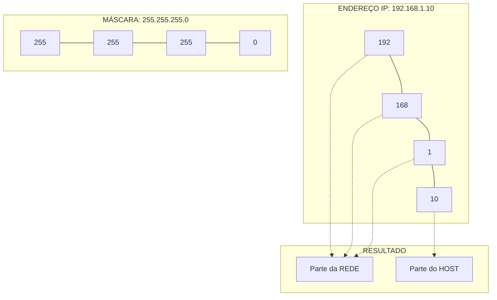

# 4. ENDEREÇAMENTO E INFRAESTRUTURA DE REDES

## 4.1 ENDEREÇAMENTO IP (IPv4 E IPv6)

**O QUE É UM ENDEREÇO IP?**

O Endereço IP (*Internet Protocol*) é um identificador lógico e único atribuído a cada dispositivo em uma rede. Ele tem duas funções principais: identificar o host (o dispositivo) e fornecer a localização dele na rede para que os dados possam ser roteados até ele.
- **Analogia:** O endereço da sua casa. O nome da rua representa a **Rede** (o bairro), e o número da casa representa o **Host** (o dispositivo específico). Sem o número da casa, o carteiro sabe o bairro, mas não sabe onde entregar.

**A LÓGICA DO IPv4**

O IPv4 (*Internet Protocol version 4*) utiliza **32 bits**, divididos em 4 grupos de 8 bits (chamados de octetos), separados por pontos. Cada octeto é representado em decimal, variando de 0 a 255.

- **Exemplo:** `192.168.1.10`

- **O Problema:** Com 32 bits, o IPv4 suporta apenas cerca de 4,3 bilhões de endereços únicos. Com a explosão de smartphones, IoT e computadores, esse espaço se esgotou globalmente.

**A SOLUÇÃO: IPv6**

O IPv6 (*Internet Protocol version 6*) foi criado para resolver a exaustão do IPv4. Ele utiliza **128 bits**, representados em hexadecimal e separados por dois pontos.

- **Exemplo:** `2001:0db8:85a3:0000:0000:8a2e:0370:7334`

- **Analogia:** Se o IPv4 é como um número de telefone local de 8 dígitos, o IPv6 é como um número que inclui código do país, DDD, número principal e um ramal secreto. Ele oferece tantos endereços que poderíamos atribuir um IP único para **cada grão de areia na Terra** e ainda sobrariam bilhões.

---

## 4.2 CLASSES DE IP E MÁSCARAS DE REDE

**AS CLASSES DE ENDEREÇO IPv4**

Historicamente, os endereços IPv4 foram divididos em classes para organizar o tamanho das redes. Embora hoje usemos principalmente o *CIDR* (roteamento sem classe), entender as classes é vital para fundamentos e provas de certificação.

- **CLASSE A:** Para redes gigantescas. O primeiro octeto define a rede. (Faixa: 1.0.0.0 a 126.255.255.255).

- **CLASSE B:** Para redes de médio porte (universidades, grandes empresas). Os dois primeiros octetos definem a rede. (Faixa: 128.0.0.0 a 191.255.255.255).

- **CLASSE C:** Para redes pequenas (escritórios, residências). Os três primeiros octetos definem a rede. (Faixa: 192.0.0.0 a 223.255.255.255). *Ex: 192.168.x.x é a mais comum em casas.*

- **CLASSE D:** Reservada para **Multicast** (envio de dados para um grupo específico, como streaming de vídeo).

- **CLASSE E:** Reservada para fins experimentais e de pesquisa.

**O PAPEL DA MÁSCARA DE SUB-REDE (SUBNET MASK)**

O endereço IP, por si só, não diz ao computador onde termina a "rede" e onde começa o "host". A Máscara de Rede é a regra que faz essa divisão.

- **Analogia:** Se o IP é "Rua das Flores, 123", a Máscara de Rede é a convenção que diz: "Os três primeiros números são o bairro (Rede), o último número é a casa (Host)".

- **Exemplo Prático:** 
  - IP: `192.168.1.10`
  - Máscara: `255.255.255.0`
  - *Interpretação:* Os três primeiros "255" indicam que `192.168.1` é a rede. O "0" indica que o `.10` é o host.

> 💡 **VISUALIZAÇÃO DA MÁSCARA DE REDE**



---

## 4.3 EQUIPAMENTOS DE REDES

Cada dispositivo de rede opera em uma camada específica do modelo OSI e tem uma função distinta no fluxo de dados.

**HUB (CONCENTRADOR)**
- **Camada OSI:** 1 (Física).
- **Função:** Recebe um sinal em uma porta e o replica (repete) cegamente para **todas** as outras portas.
- **Analogia:** Uma pessoa que entra em uma sala e **grita** uma mensagem. Todos ouvem, mas apenas a pessoa com o nome chamado presta atenção. Gera muita "colisão" e desperdício de banda. Obsoleto hoje em dia.

**SWITCH (COMUTADOR)**
- **Camada OSI:** 2 (Enlace de Dados).
- **Função:** Inteligente. Ele aprende os endereços MAC (físicos) de cada dispositivo conectado a ele. Quando recebe um dado, ele o envia **apenas** para a porta de destino correta.
- **Analogia:** Uma **telefonista inteligente** ou um carteiro interno de um prédio. Ela sabe exatamente em qual sala (porta) cada pessoa está e entrega a mensagem diretamente, sem incomodar os outros.

**ROTEADOR (ROUTER)**
- **Camada OSI:** 3 (Rede).
- **Função:** Conecta **redes diferentes** (ex: sua rede doméstica à Internet). Ele usa endereços IP lógicos para decidir o melhor caminho (rota) para os pacotes de dados viajarem.
- **Analogia:** O **centro de triagem dos Correios**. Ele não entrega a carta na casa final, mas decide se a carta deve ir de caminhão para a cidade vizinha ou de avião para outro país.

**ACCESS POINT (PONTO DE ACESSO)**
- **Camada OSI:** 1 e 2.
- **Função:** Converte o sinal de rede cabeada (Ethernet) em sinal de rádio (Wi-Fi) e vice-versa, permitindo que dispositivos sem fio se conectem à rede local.
- **Analogia:** Um **tradutor simultâneo**. Ele pega a "língua" dos cabos (elétrica) e a traduz para a "língua" do ar (ondas de rádio).

**FIREWALL (PAREDE DE FOGO)**
- **Camada OSI:** 3 a 7 (dependendo da complexidade).
- **Função:** Dispositivo de segurança que monitora e controla o tráfego de rede com base em regras de segurança predeterminadas. Ele bloqueia tráfego não autorizado.
- **Analogia:** O **segurança na porta de uma balada**. Ele checa a lista de convidados (regras). Se você não estiver na lista ou estiver se comportando mal (tráfego malicioso), ele barra sua entrada.

> 💡 **VISUALIZAÇÃO DO FLUXO DOS EQUIPAMENTOS**

```mermaid
graph LR
    subgraph rede_local ["REDE LOCAL (LAN)"]
        PC1[PC 1] --- SW[Switch Inteligente]
        PC2[PC 2] --- SW
        AP[Access Point] --- SW
        Cel[Celular Wi-Fi] -.- AP
    end

    FW[Firewall] --- R[Router]
    SW --- FW
    R ===|Internet (WAN)| Nuvem((Internet))
```

---

## 4.4 MEIOS DE COMUNICAÇÃO

O meio de transmissão é o caminho físico (Camada 1) por onde os bits viajam. A escolha do meio impacta diretamente a velocidade, a distância e a segurança.

**MEIOS METÁLICOS (COBRE)**
- **Par Trançado (Twisted Pair):** O padrão das redes locais (cabos CAT5e, CAT6). Os fios são trançados para cancelar interferências eletromagnéticas externas (ruído).
  - *Analogia:* Duas pessoas caminhando de braços dados em uma multidão; o trançado as mantém estáveis e impede que sejam empurradas para fora do caminho.

- **Cabo Coaxial:** Um condutor central rodeado por isolamento e uma malha metálica de blindagem.
  - *Uso:* Antigas redes de computadores e, atualmente, TV a cabo e internet a cabo (DOCSIS).

**FIBRA ÓPTICA**
- **Definição:** Utiliza pulsos de **luz** (laser ou LED) para transmitir dados através de um núcleo de vidro ou plástico extremamente fino.
- **Vantagens:** Imune a interferências eletromagnéticas (não sofre com ruído de motores ou raios), oferece velocidades altíssimas (Gbps a Tbps) e alcança distâncias de dezenas de quilômetros sem precisar de repetidores.
- **Analogia:** Um **tubo espelhado**. Você aponta uma lanterna em uma extremidade, e a luz reflete nas paredes espelhadas até chegar à outra ponta, sem vazar para fora e sem sofrer interferência do que está fora do tubo.

**WIRELESS (IEEE 802.11 / Wi-Fi)**
- **Definição:** Utiliza ondas de rádio (frequentemente nas faixas de 2.4 GHz e 5 GHz) para transmitir dados pelo ar.
- **Vantagens:** Mobilidade total e facilidade de instalação (sem obras para passar cabos).
- **Desvantagens:** Suscetível a interferências (paredes grossas, micro-ondas, outras redes Wi-Fi), menor velocidade que o cabo e maior risco de interceptação de dados (segurança).
- **Analogia:** Uma **transmissão de rádio FM**. Qualquer um com um sintonizador na frequência certa e dentro do alcance pode ouvir. Paredes e prédios enfraquecem o sinal.

---

## 4.5 RESUMO DO MÓDULO 4 (PARA FIXAÇÃO)

- **IPv4 vs IPv6:** IPv4 (32 bits, esgotado) usa decimais. IPv6 (128 bits, futuro) usa hexadecimais e resolve a falta de endereços.

- **IP e Máscara:** O IP identifica. A Máscara define qual parte do IP é a Rede e qual é o Host.

- **Equipamentos:** **Hub** (burro, repete tudo), **Switch** (inteligente, usa MAC, entrega no destino), **Roteador** (conecta redes diferentes, usa IP), **Firewall** (segurança, filtra regras).

- **Meios:** **Cobre** (barato, curta distância, sofre interferência), **Fibra** (luz, longa distância, imune a ruído), **Wireless** (mobilidade, sujeito a interferência e barreiras físicas).
