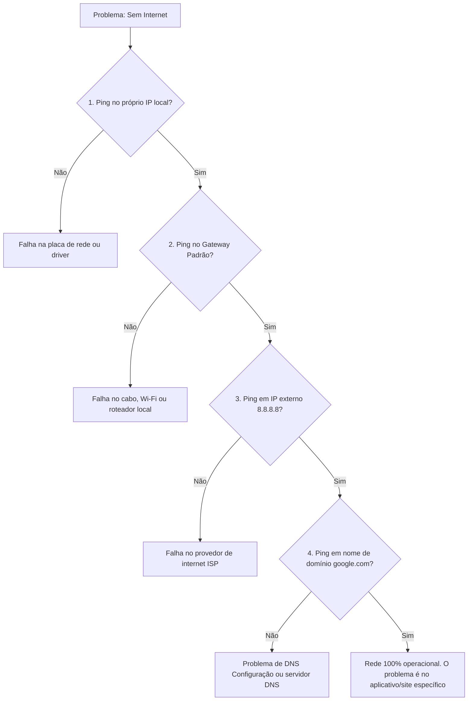
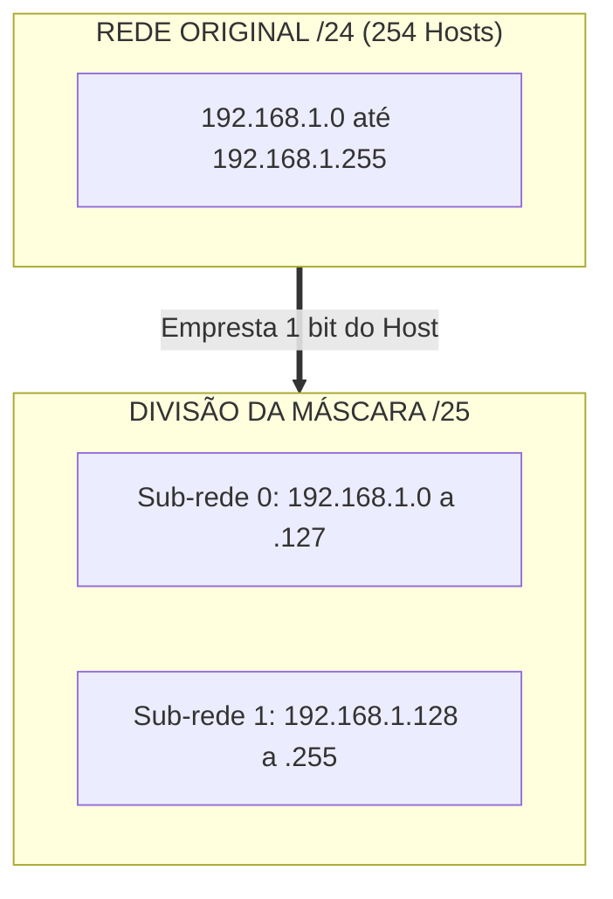
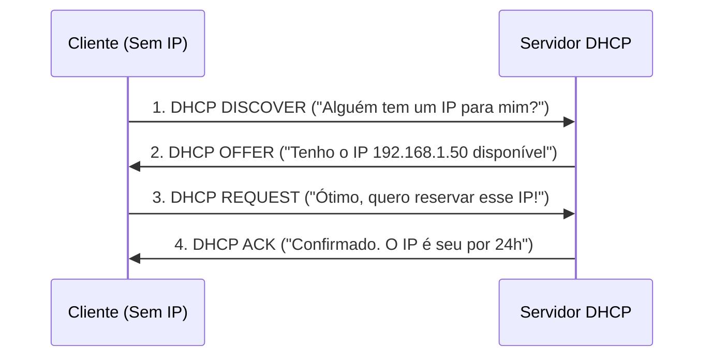

# 5. FERRAMENTAS PRÁTICAS E DIAGNÓSTICO DE REDES

## 5.1 UTILITÁRIOS DE REDES

**O "ESTETOSCÓPIO" DO ENGENHEIRO DE REDES**

Quando uma rede falha, não chutamos a máquina. Usamos utilitários de linha de comando (CLI) para isolar o problema. Estes são os 5 pilares do diagnóstico:

**PING (ICMP)**
- **O que faz:** Envia pequenos pacotes de eco para um destino e espera uma resposta. Testa a conectividade básica e a latência.
- **Analogia:** Um **sonar de submarino** ou gritar "Alô!" em uma caverna. Se o eco voltar, há um caminho livre. Se não voltar, há um obstáculo ou o destino está "surdo" (bloqueado).

**TRACERT (TRACEROUTE NO LINUX/MAC)**
- **O que faz:** Mapeia todos os "saltos" (roteadores) que um pacote percorre desde a sua máquina até o destino final, mostrando o tempo de resposta de cada um.
- **Analogia:** O **rastreamento de uma encomenda dos Correios**. Você não vê apenas "Saiu" e "Entregue"; você vê "Centro de Distribuição SP", "Triagem RJ", "Agência Local", identificando exatamente em qual ponto a encomenda travou.

**IPCONFIG (IFCONFIG NO LINUX/MAC)**
- **O que faz:** Exibe toda a configuração de rede atual da sua própria máquina: Endereço IP, Máscara de Sub-rede, Gateway Padrão e servidores DNS. O comando `ipconfig /release` e `/renew` força a renegociação com o servidor DHCP.
- **Analogia:** Olhar para a **sua própria carteira de identidade e extrato bancário**. Você está verificando seus próprios dados (quem você é na rede e quem é o seu "gerente" local, o Gateway).

**NSLOOKUP**
- **O que faz:** Consulta diretamente os servidores DNS para traduzir um nome de domínio (ex: google.com) em um endereço IP, ou vice-versa.
- **Analogia:** Consultar a **lista telefônica**. Você dá o nome da pessoa (domínio) e a lista retorna o número do telefone (endereço IP). Se a lista estiver errada, você não consegue ligar, mesmo que o telefone da pessoa funcione.

**NETSTAT**
- **O que faz:** Exibe todas as conexões de rede ativas, portas de escuta e estatísticas de protocolos no seu computador.
- **Analogia:** O **livro de registro do segurança na portaria**. Ele mostra exatamente quem está entrando ou saindo do prédio (conexões) e por quais portas específicas (número da porta, ex: 80, 443) isso está acontecendo.

---

## 5.2 DIAGNÓSTICO PRÁTICO

**COMO INTERPRETAR AS SAÍDAS (OUTPUTS)**
Saber digitar o comando é fácil; saber ler o resultado é o que separa o amador do profissional. Vamos a exemplos reais:

**CENÁRIO 1: VERIFICANDO A CONFIGURAÇÃO LOCAL**
Ao digitar `ipconfig` (no Windows), você vê:
```text
Adaptador de Ethernet Ethernet0:
   Endereço IPv4. . . . . . . . . . . . : 192.168.1.15
   Máscara de Sub-rede  . . . . . . . . : 255.255.255.0
   Gateway Padrão . . . . . . . . . . . : 192.168.1.1
   Servidores DNS . . . . . . . . . . . : 8.8.8.8
```
- **Interpretação do Instrutor:** Sua máquina é o host `.15` na rede `192.168.1`. Para sair para a internet, ela manda os dados para o Gateway (`192.168.1.1`, geralmente seu roteador). Se o Gateway estivesse em branco, você só falaria com computadores da sua sala, mas não com a internet.

**CENÁRIO 2: TESTANDO A CONEXÃO**
Ao digitar `ping 8.8.8.8`, você vê:
```text
Resposta de 8.8.8.8: bytes=32 tempo=14ms TTL=116
Resposta de 8.8.8.8: bytes=32 tempo=15ms TTL=116
```
- **Interpretação do Instrutor:** Sucesso! O "tempo" (latência) está baixo (14-15ms), o que é ótimo. O "TTL" (Time To Live) é um contador que diminui a cada roteador que o pacote passa; um valor inicial alto (como 116) indica que o destino está relativamente "perto" em termos de saltos de rede.

**CENÁRIO 3: O ERRO CLÁSSICO**
Ao digitar `ping google.com`, você vê:
```text
Falha na resolução do nome de host google.com.
```
- **Interpretação do Instrutor:** Sua internet *pode* estar funcionando, mas seu **DNS** falhou. O computador não sabe qual é o IP do "google.com". A solução? Testar o `nslookup` ou trocar os servidores DNS nas configurações.

> 💡 **FLUXOGRAMA DE DIAGNÓSTICO LÓGICO**
> *Use esta lógica para resolver 90% dos problemas de rede.*



---

## 5.3 NOÇÕES PRÁTICAS DE SUB-REDES E SEGURANÇA

Embora o cálculo matemático de sub-redes seja um tópico avançado, o profissional de TI precisa entender a **lógica prática** por trás disso e como ela se relaciona com a segurança e as ferramentas que acabamos de ver.

**A LÓGICA PRÁTICA DO SUBNETTING (DIVISÃO DE REDES)**

- **O que é:** Pegar uma rede grande (ex: Classe C, que suporta 254 hosts) e dividi-la em redes menores usando a Máscara de Sub-rede.

- **Por que fazer?** 
  1. **Desempenho:** Reduz o "domínio de broadcast". Em uma rede gigante, quando um computador manda uma mensagem para "todos", 1000 máquinas param para processar. Em sub-redes pequenas, esse ruído é contido.

  2. **Organização:** Separa departamentos (ex: Rede 192.168.10.x para o RH, 192.168.20.x para a TI).

- **Analogia:** Transformar um **grande salão de festas aberto** (uma rede única, barulhenta e caótica) em **várias salas de reunião com portas** (sub-redes). O tráfego de cada sala fica contido, e você só abre a porta (roteador) quando é necessário comunicar com outra sala.

**SEGURANÇA NO DIAGNÓSTICO PRÁTICO**

As ferramentas de rede também são armas de dois gumes. Um invasor usa as mesmas ferramentas que você para mapear uma rede antes de atacar.

- **O "Ping Silencioso":** Muitos firewalls corporativos são configurados para **bloquear requisições ICMP (Ping)**. Portanto, se um `ping` falha, *não significa necessariamente* que o servidor está desligado; pode ser apenas uma regra de segurança (Firewall) ocultando sua existência.

- **Portas Abertas (Netstat):** Se o `netstat` mostrar uma porta estranha (ex: porta 4444) ouvindo conexões ("LISTENING") em um computador que deveria ser apenas uma estação de trabalho, é um forte indício de malware ou um serviço não autorizado rodando em segundo plano.

---

## 5.4 CÁLCULO PRÁTICO DE SUB-REDES (SUBNETTING)

**A MATEMÁTICA POR TRÁS DA DIVISÃO (EMPRÉSTIMO DE BITS)**

Para criar sub-redes na prática, nós "emprestamos" bits da parte do *Host* (máquina) e os adicionamos à parte da *Rede*, alterando a Máscara de Sub-rede.

- **Exemplo Prático:** Temos a rede `192.168.1.0` com máscara `255.255.255.0` (ou `/24`, pois 24 bits são de rede). Ela suporta 254 hosts úteis.
- **O Objetivo:** Dividir em 2 sub-redes menores para separar o setor administrativo do setor de convidados.
- **A Ação:** Emprestamos 1 bit do host. A nova máscara vira `/25` (ou `255.255.255.128`).
- **O Resultado:** Agora temos duas redes isoladas:
  1. `192.168.1.0` a `192.168.1.127` (126 hosts úteis)
  2. `192.168.1.128` a `192.168.1.255` (126 hosts úteis)

> 💡 **VISUALIZAÇÃO DO SUBNETTING**



**FALLBACK EM TEXTO (ASCII):**
```text
REDE ORIGINAL (/24):  [ 192.168.1.0  -----------------  192.168.1.255 ] (254 hosts, muito ruído)
                             |
                             | (Aplica-se a máscara /25)
                             v
SUB-REDE 0 (/25):       [ 192.168.1.0   a   192.168.1.127 ] (126 hosts, setor A)
SUB-REDE 1 (/25):       [ 192.168.1.128 a   192.168.1.255 ] (126 hosts, setor B)
```

---

## 5.5 PROTOCOLOS DE APLICAÇÃO E SERVIÇOS

Estes são os protocolos da **Camada 7 (Aplicação)** do modelo OSI. Eles são a interface direta entre o software do usuário e a rede.

**DHCP (DYNAMIC HOST CONFIGURATION PROTOCOL)**
- **Função:** Distribui automaticamente endereços IP, máscaras e gateways para os dispositivos, evitando conflitos manuais.
- **Analogia:** O **recepcionista de um hotel**. Quando você chega, ele verifica um quarto vago, te entrega a chave com o número do quarto (IP) e anota até quando você pode ficar (lease time).
- **Processo DORA:** *Discover* (Descobrir), *Offer* (Oferecer), *Request* (Solicitar), *Acknowledge* (Confirmar).

**DNS (DOMAIN NAME SYSTEM)**
- **Função:** Traduz nomes de domínio legíveis por humanos (ex: `www.google.com`) em endereços IP numéricos que os computadores entendem.
- **Analogia:** A **lista telefônica** da internet. Você busca pelo nome, o DNS retorna o número (IP).

**HTTP E HTTPS (HYPERTEXT TRANSFER PROTOCOL)**
- **Função:** Regula a transferência de páginas web. O "S" no final significa *Secure* (Seguro), indicando que os dados são criptografados.
- **Analogia:** O **garçom em um restaurante**. O HTTP leva seu pedido à cozinha. O HTTPS é esse mesmo garçom, mas colocando o pedido dentro de uma **caixa forte trancada**, impedindo que alguém espione o conteúdo no caminho.

**FTP (FILE TRANSFER PROTOCOL)**
- **Função:** Transferência eficiente de arquivos.
- **Analogia:** Uma **empresa de mudanças com dois caminhões**. Um caminhão (porta 21) leva a lista de inventário e as instruções (canal de controle). O outro caminhão (porta 20) carrega efetivamente os móveis (canal de dados).

> 💡 **VISUALIZAÇÃO DO PROCESSO DHCP (DORA)**



---

## 5.6 INTRODUÇÃO À SEGURANÇA DE REDES

**A TRÍADE CID (CONFIDENCIALIDADE, INTEGRIDADE, DISPONIBILIDADE)**
Toda estratégia de segurança de rede gira em torno de proteger estes três pilares:
1. **Confidencialidade:** Apenas pessoas autorizadas podem ler os dados.
2. **Integridade:** Os dados não foram alterados ou corrompidos durante o trânsito.
3. **Disponibilidade:** Os dados e a rede estão acessíveis quando necessários.

**FIREWALL (PAREDE DE FOGO)**
- **Função:** Filtra o tráfego de rede com base em regras de segurança pré-definidas (ex: "Bloquear toda entrada na porta 23").
- **Analogia:** O **segurança na porta de uma balada**. Ele tem uma lista de convidados (regras). Se você não estiver na lista, ele barra sua entrada, protegendo quem está lá dentro.

**VPN (VIRTUAL PRIVATE NETWORK)**
- **Função:** Cria um "túnel" criptografado através de uma rede pública (como a Internet), permitindo acesso remoto seguro à rede corporativa.
- **Analogia:** Um **túnel blindado e secreto** atravessando uma cidade perigosa. Mesmo que alguém veja o caminhão passando, não consegue ver o que está dentro dele nem alterar a carga.

---

## 5.7 RESUMO

- **FERRAMENTAS:** **Ping** testa conectividade. **Tracert** mostra o caminho. **Ipconfig** mostra sua identidade na rede. **Nslookup** testa o DNS. **Netstat** mostra portas abertas.
- **SUBNETTING:** Divide redes grandes em menores "emprestando" bits do host para a rede, reduzindo ruído (broadcast) e melhorando a organização.
- **PROTOCOLOS:** **DHCP** entrega IPs automaticamente (Processo DORA). **DNS** traduz nomes em IPs. **HTTP/HTTPS** transfere páginas web (HTTPS é criptografado). **FTP** transfere arquivos usando duas portas (controle e dados).
- **SEGURANÇA:** Baseia-se na Tríade CID. **Firewalls** filtram tráfego indesejado. **VPNs** criam túneis seguros através da internet pública.
- **DIAGNÓSTICO:** Firewalls podem bloquear Pings de propósito. Sempre correlacione os resultados de múltiplas ferramentas antes de concluir que um servidor está offline.
