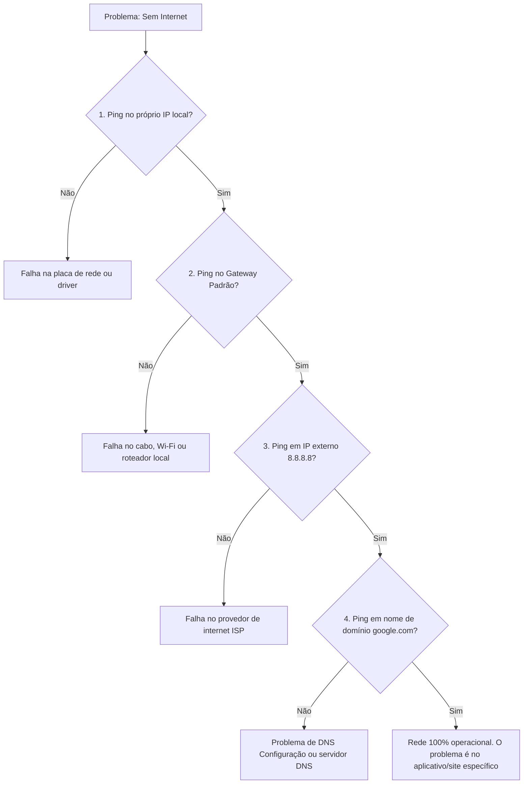

# 5. FERRAMENTAS PRÁTICAS E DIAGNÓSTICO DE REDES

## 5.1 UTILITÁRIOS DE REDES

**O "ESTETOSCÓPIO" DO ENGENHEIRO DE REDES**

Quando uma rede falha, não chutamos a máquina. Usamos utilitários de linha de comando (CLI) para isolar o problema. Estes são os 5 pilares do diagnóstico:

**PING (ICMP)**
- **O que faz:** Envia pequenos pacotes de eco para um destino e espera uma resposta. Testa a conectividade básica e a latência.
- **Analogia:** Um **sonar de submarino** ou gritar "Alô!" em uma caverna. Se o eco voltar, há um caminho livre. Se não voltar, há um obstáculo ou o destino está "surdo" (bloqueado).

**TRACERT (TRACEROUTE NO LINUX/MAC)**
- **O que faz:** Mapeia todos os "saltos" (roteadores) que um pacote percorre desde a sua máquina até o destino final, mostrando o tempo de resposta de cada um.
- **Analogia:** O **rastreamento de uma encomenda dos Correios**. Você não vê apenas "Saiu" e "Entregue"; você vê "Centro de Distribuição SP", "Triagem RJ", "Agência Local", identificando exatamente em qual ponto a encomenda travou.

**IPCONFIG (IFCONFIG NO LINUX/MAC)**
- **O que faz:** Exibe toda a configuração de rede atual da sua própria máquina: Endereço IP, Máscara de Sub-rede, Gateway Padrão e servidores DNS. O comando `ipconfig /release` e `/renew` força a renegociação com o servidor DHCP.
- **Analogia:** Olhar para a **sua própria carteira de identidade e extrato bancário**. Você está verificando seus próprios dados (quem você é na rede e quem é o seu "gerente" local, o Gateway).

**NSLOOKUP**
- **O que faz:** Consulta diretamente os servidores DNS para traduzir um nome de domínio (ex: google.com) em um endereço IP, ou vice-versa.
- **Analogia:** Consultar a **lista telefônica**. Você dá o nome da pessoa (domínio) e a lista retorna o número do telefone (endereço IP). Se a lista estiver errada, você não consegue ligar, mesmo que o telefone da pessoa funcione.

**NETSTAT**
- **O que faz:** Exibe todas as conexões de rede ativas, portas de escuta e estatísticas de protocolos no seu computador.
- **Analogia:** O **livro de registro do segurança na portaria**. Ele mostra exatamente quem está entrando ou saindo do prédio (conexões) e por quais portas específicas (número da porta, ex: 80, 443) isso está acontecendo.

---

## 5.2 DIAGNÓSTICO PRÁTICO

**COMO INTERPRETAR AS SAÍDAS (OUTPUTS)**
Saber digitar o comando é fácil; saber ler o resultado é o que separa o amador do profissional. Vamos a exemplos reais:

**CENÁRIO 1: VERIFICANDO A CONFIGURAÇÃO LOCAL**
Ao digitar `ipconfig` (no Windows), você vê:
```text
Adaptador de Ethernet Ethernet0:
   Endereço IPv4. . . . . . . . . . . . : 192.168.1.15
   Máscara de Sub-rede  . . . . . . . . : 255.255.255.0
   Gateway Padrão . . . . . . . . . . . : 192.168.1.1
   Servidores DNS . . . . . . . . . . . : 8.8.8.8
```
- **Interpretação do Instrutor:** Sua máquina é o host `.15` na rede `192.168.1`. Para sair para a internet, ela manda os dados para o Gateway (`192.168.1.1`, geralmente seu roteador). Se o Gateway estivesse em branco, você só falaria com computadores da sua sala, mas não com a internet.

**CENÁRIO 2: TESTANDO A CONEXÃO**
Ao digitar `ping 8.8.8.8`, você vê:
```text
Resposta de 8.8.8.8: bytes=32 tempo=14ms TTL=116
Resposta de 8.8.8.8: bytes=32 tempo=15ms TTL=116
```
- **Interpretação do Instrutor:** Sucesso! O "tempo" (latência) está baixo (14-15ms), o que é ótimo. O "TTL" (Time To Live) é um contador que diminui a cada roteador que o pacote passa; um valor inicial alto (como 116) indica que o destino está relativamente "perto" em termos de saltos de rede.

**CENÁRIO 3: O ERRO CLÁSSICO**
Ao digitar `ping google.com`, você vê:
```text
Falha na resolução do nome de host google.com.
```
- **Interpretação do Instrutor:** Sua internet *pode* estar funcionando, mas seu **DNS** falhou. O computador não sabe qual é o IP do "google.com". A solução? Testar o `nslookup` ou trocar os servidores DNS nas configurações.

> 💡 **FLUXOGRAMA DE DIAGNÓSTICO LÓGICO**
> *Use esta lógica para resolver 90% dos problemas de rede.*



**FALLBACK EM TEXTO (ASCII) - FLUXO DE DIAGNÓSTICO:**
```text
[Sem Internet] 
   |
   +-> 1. Ping no meu próprio IP? (NÃO = Placa de rede com defeito)
   |
   +-> 2. Ping no Gateway (Roteador)? (NÃO = Cabo solto ou Wi-Fi desconectado)
   |
   +-> 3. Ping em 8.8.8.8 (IP Externo)? (NÃO = Provedor de Internet derrubado)
   |
   +-> 4. Ping em google.com (Nome)? (NÃO = Problema no servidor DNS)
   |
   +-> SE PASSOU POR TODOS: A rede está ótima. O problema é o navegador ou o site caiu.
```

---

## 5.3 NOÇÕES PRÁTICAS DE SUB-REDES E SEGURANÇA

Embora o cálculo matemático de sub-redes seja um tópico avançado, o profissional de TI precisa entender a **lógica prática** por trás disso e como ela se relaciona com a segurança e as ferramentas que acabamos de ver.

**A LÓGICA PRÁTICA DO SUBNETTING (DIVISÃO DE REDES)**
- **O que é:** Pegar uma rede grande (ex: Classe C, que suporta 254 hosts) e dividi-la em redes menores usando a Máscara de Sub-rede.
- **Por que fazer?** 
  1. **Desempenho:** Reduz o "domínio de broadcast". Em uma rede gigante, quando um computador manda uma mensagem para "todos", 1000 máquinas param para processar. Em sub-redes pequenas, esse ruído é contido.
  2. **Organização:** Separa departamentos (ex: Rede 192.168.10.x para o RH, 192.168.20.x para a TI).
- **Analogia:** Transformar um **grande salão de festas aberto** (uma rede única, barulhenta e caótica) em **várias salas de reunião com portas** (sub-redes). O tráfego de cada sala fica contido, e você só abre a porta (roteador) quando é necessário comunicar com outra sala.

**SEGURANÇA NO DIAGNÓSTICO PRÁTICO**
As ferramentas de rede também são armas de dois gumes. Um invasor usa as mesmas ferramentas que você para mapear uma rede antes de atacar.
- **O "Ping Silencioso":** Muitos firewalls corporativos são configurados para **bloquear requisições ICMP (Ping)**. Portanto, se um `ping` falha, *não significa necessariamente* que o servidor está desligado; pode ser apenas uma regra de segurança (Firewall) ocultando sua existência.
- **Portas Abertas (Netstat):** Se o `netstat` mostrar uma porta estranha (ex: porta 4444) ouvindo conexões ("LISTENING") em um computador que deveria ser apenas uma estação de trabalho, é um forte indício de malware ou um serviço não autorizado rodando em segundo plano.

---

## 5.4 RESUMO DO MÓDULO 5 (PARA FIXAÇÃO)

- **PING:** Testa se o destino responde (ICMP). É o "Alô!" da rede.
- **TRACERT:** Mostra o caminho e onde a conexão falha (os saltos).
- **IPCONFIG:** Mostra seus próprios dados de identidade na rede (IP, Máscara, Gateway, DNS).
- **NSLOOKUP:** Testa se a "lista telefônica" (DNS) está funcionando e traduzindo nomes corretamente.
- **NETSTAT:** Revela quais portas e conexões estão ativas no seu computador agora.
- **SUB-REDES:** Dividem redes grandes em menores para reduzir ruído (broadcast) e melhorar a organização e segurança.
- **SEGURANÇA:** Firewalls podem bloquear Pings de propósito. Sempre correlacione os resultados de múltiplas ferramentas antes de concluir um diagnóstico.
