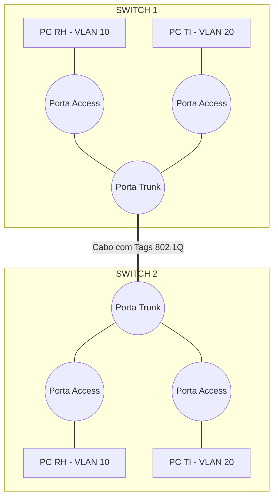

# 6. SEGMENTAÇÃO AVANÇADA, ROTEAMENTO E CONFIGURAÇÃO PRÁTICA

## 6.1 VLANs (VIRTUAL LOCAL AREA NETWORK)

**O QUE É UMA VLAN?**

Uma VLAN é uma rede local lógica criada dentro de um switch físico. Ela permite que um único switch seja dividido em múltiplas redes virtuais isoladas, como se houvesse vários switches físicos separados no mesmo equipamento.
- **Analogia:** Imagine um **prédio de escritórios de andares abertos (open space)**. Fisicamente, todos estão no mesmo prédio (o mesmo switch). Mas, logicamente, o RH fica em uma "sala" e a TI em outra. Um funcionário do RH não pode simplesmente caminhar e pegar documentos da TI; ele precisa de uma autorização especial (um roteador) para cruzar essa fronteira lógica.

**POR QUE USAR VLANs?**

1. **Segurança:** Isola departamentos sensíveis (ex: Financeiro) do tráfego geral.
 inaudível.
2. **Desempenho:** Contém o tráfego de *broadcast* (mensagens para todos) dentro da VLAN, evitando que ele inunde toda a rede.
3. **Flexibilidade:** Se um funcionário do RH mudar de mesa física (de uma porta do switch para outra), o administrador de rede apenas muda a configuração da porta para a VLAN do RH. Não é necessário passar novos cabos.

**CONCEITOS-CHAVE: ACCESS VS. TRUNK**
- **Porta de Acesso (Access Port):** Conecta dispositivos finais (PCs, impressoras). Pertence a apenas **uma** VLAN.
- **Porta Tronco (Trunk Port):** Conecta switches entre si ou switches a roteadores. É um "tubo" que carrega o tráfego de **múltiplas VLANs** simultaneamente, usando uma "etiqueta" (protocolo 802.1Q) para identificar a qual VLAN cada pacote pertence.
- **Analogia:** A porta de acesso é como um **corredor exclusivo** de um departamento. A porta Trunk é como um **elevador principal** do prédio: pessoas de todos os andares (VLANs) usam o mesmo elevador, mas cada uma tem um crachá (tag 802.1Q) que diz para qual andar ela deve ir.

> 💡 **VISUALIZAÇÃO DE UMA VLAN COM TRUNK**



---

## 6.2 ROTEAMENTO: ESTÁTICO VS. DINÂMICO

**O PAPEL DO ROTEADOR**

Enquanto o Switch (Camada 2) toma decisões baseadas em endereços MAC dentro da mesma rede, o Roteador (Camada 3) conecta redes **diferentes** e toma decisões baseadas em endereços IP. Para isso, ele usa uma **Tabela de Roteamento** (um mapa de destinos).

**ROTEAMENTO ESTÁTICO**
- **Definição:** O administrador de rede insere manualmente cada rota na tabela do roteador.
- **Analogia:** Escrever **instruções de direção em um papel** ("Vire à direita na praça, depois 2km reto"). 
- **Vantagem/Desvantagem:** Extremamente seguro e não consome processamento do roteador. Porém, se uma estrada (link) cair, o roteador não sabe desviar; ele simplesmente descarta o pacote. Ideal para redes pequenas e estáveis.

**ROTEAMENTO DINÂMICO**
- **Definição:** Os roteadores conversam entre si usando protocolos específicos, compartilhando informações sobre as redes que conhecem e construindo suas tabelas de roteamento automaticamente.
- **Analogia:** Usar o **Waze ou Google Maps**. Se houver um engarrafamento ou um acidente (falha no link), o aplicativo recalcula a rota e desvia o tráfego automaticamente, sem que o motorista (administrador) precise fazer nada.

---

## 6.3 PROTOCOLOS DE ROTEAMENTO DINÂMICO

Existem diferentes "sabores" de Waze (protocolos) que os roteadores usam para aprender o caminho. Os principais são:

**RIP (ROUTING INFORMATION PROTOCOL)**
- **Como funciona:** É um protocolo de "Vetor de Distância". Ele escolhe o melhor caminho contando apenas o **número de saltos** (quantos roteadores o pacote precisa atravessar). O limite máximo é 15 saltos.
- **Analogia:** Perguntar a moradores locais: "Quantas cidades devo atravessar para chegar lá?". Ele não sabe se a estrada é uma rodovia asfaltada ou uma trilha de terra, só conta a quantidade de cidades.

**OSPF (OPEN SHORTEST PATH FIRST)**
- **Como funciona:** É um protocolo de "Estado de Link". Cada roteador monta um **mapa completo e detalhado** de toda a rede e usa um algoritmo matemático (Dijkstra) para calcular o caminho mais rápido, considerando a **largura de banda** (velocidade) do link, não apenas o número de saltos.
- **Analogia:** Ter um **GPS de última geração** que sabe que, embora a rota A tenha menos cidades, ela é uma estrada de terra, enquanto a rota B é uma rodovia de 4 faixas, escolhendo a rota B por ser mais rápida. É o padrão da indústria atual.

**EIGRP (ENHANCED INTERIOR GATEWAY ROUTING PROTOCOL)**
- **Como funciona:** Um protocolo "Híbrido" (proprietário da Cisco, embora tenha versões abertas). Combina a facilidade de configuração do RIP com a inteligência e velocidade de convergência do OSPF.
- **Analogia:** O **Waze Premium**. Tem as melhores funcionalidades de ambos os mundos, mas historicamente funcionava melhor (ou apenas) em equipamentos da mesma marca (Cisco).

---

## 6.4 NOÇÕES BÁSICAS DE CONFIGURAÇÃO (CLI CISCO)

**ENTENDENDO A INTERFACE DE LINHA DE COMANDO (CLI)**
Configurar equipamentos de rede profissionais (como switches e roteadores Cisco) é feito via CLI (Command Line Interface), não por janelas gráficas bonitas. A CLI possui níveis de privilégio, como camadas de segurança de um prédio.

**OS MODOS DE COMANDO:**
1. **Modo de Usuário (`Router>`):** O "hall de entrada". Permite apenas comandos básicos de visualização (ex: `ping`). Não permite alterações.
2. **Modo Privilegiado (`Router#`):** O "escritório do gerente". Obtido digitando `enable`. Permite ver configurações detalhadas e reiniciar o equipamento, mas ainda não permite mudar a configuração.
3. **Modo de Configuração Global (`Router(config)#`):** A "sala de servidores". Obtido digitando `configure terminal`. É aqui que as mudanças reais são feitas.

**EXEMPLO PRÁTICO DE CONFIGURAÇÃO:**
Vamos configurar o nome de um roteador e ativar sua primeira interface de rede.

```text
Router> enable                   ! Entra no modo privilegiado (o prompt muda para #)
Router# configure terminal       ! Entra no modo de configuração global
Router(config)# hostname R1      ! Muda o nome do equipamento para "R1"
R1(config)# interface gigabitethernet 0/0  ! Seleciona a porta física para configurar
R1(config-if)# ip address 192.168.1.1 255.255.255.0  ! Define o IP e a Máscara
R1(config-if)# no shutdown       ! Liga a porta (por padrão, portas Cisco nascem "desligadas")
R1(config-if)# exit              ! Sai do modo de interface
R1(config)# exit                 ! Sai do modo de configuração global
R1# write memory                 ! Salva a configuração na memória permanente
```
> 💡 **NOTA DO INSTRUTOR:** O comando `no shutdown` é a "pegadinha" clássica de provas e da vida real. O equipamento vem de fábrica com as portas administrativamente desligadas (`shutdown`). Você precisa explicitamente ligá-las.

---

## 6.5 RESUMO

- **VLANs:** Dividem um switch físico em redes lógicas isoladas. Aumentam a segurança e reduzem o tráfego de *broadcast*.
- **TRUNK (802.1Q):** O enlace que carrega múltiplas VLANs entre switches, usando "etiquetas" para identificar o tráfego.
- **ROTEAMENTO ESTÁTICO:** Configuração manual. Seguro, mas não se adapta a falhas.
- **ROTEAMENTO DINÂMICO:** Roteadores aprendem rotas automaticamente. **OSPF** é o mais usado, pois escolhe o caminho pela velocidade (largura de banda), não apenas pela contagem de saltos (RIP).
- **CLI CISCO:** A configuração é feita por comandos de texto em níveis de privilégio: Usuário (`>`), Privilegiado (`#`) e Configuração (`(config)#`). A porta só funciona após o comando `no shutdown`.
