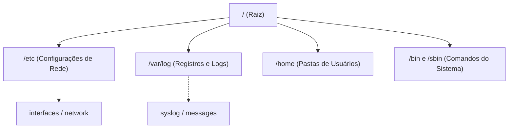

# 8. LINUX ESSENCIAL PARA PROFISSIONAIS DE REDES

## 8.1 POR QUE LINUX É OBRIGATÓRIO EM REDES?


**O SISTEMA OPERACIONAL DA INTERNET**
Enquanto o Windows domina os computadores dos usuários finais (estações de trabalho), o Linux domina a infraestrutura. Roteadores (como os baseados em OpenWRT), firewalls (pfSense, FortiOS), servidores web, DNS e a própria Nuvem (AWS, Azure) são, em sua essência, distribuições Linux.
- **Analogia:** O Windows é como um **carro com câmbio automático e painel digital**: confortável, fácil de usar, mas esconde o motor. O Linux é como a **sala de máquinas de um navio ou um carro de corrida manual**: você tem acesso direto a cada válvula, engrenagem e parafuso. Para consertar ou otimizar a rede, você precisa saber abrir esse capô.

**O CONCEITO DE "TUDO É UM ARQUIVO"**

No Linux, não existem "unidades C:" ou "D:". Tudo é organizado em uma única árvore de diretórios que começa na raiz (`/`). Até mesmo o hardware (como sua placa de rede) é representado como um arquivo especial.

---

## 8.2 A ESTRUTURA DE DIRETÓRIOS (O SISTEMA DE ARQUIVOS)

Para um profissional de redes, saber onde as coisas estão é metade da batalha. Diferente do Windows, a estrutura é padronizada.

- **`/` (Raiz):** O ponto de partida de tudo. O topo da árvore.
- **`/etc`:** O **cérebro das configurações**. Quase todos os arquivos de configuração de rede (interfaces, DNS, firewall) ficam aqui.
- **`/var/log`:** O **diário de bordo**. Onde os sistemas registram tudo o que acontece (erros, acessos, falhas de conexão). Essencial para diagnóstico.
- **`/home`:** A pasta pessoal de cada usuário (equivalente a "Meus Documentos" no Windows).
- **`/bin` e `/sbin`:** Onde ficam os programas e comandos executáveis (como `ping`, `ip`, `ls`).

> 💡 **VISUALIZAÇÃO DA ÁRVORE DE DIRETÓRIOS**



**FALLBACK EM TEXTO (ASCII):**
```text
/ (Raiz - O topo de tudo)
 ├── /etc        (Configurações: onde mexemos para mudar a rede)
 ├── /var/log    (Logs: onde olhamos quando algo dá errado)
 ├── /home       (Dados dos usuários)
 └── /bin, /sbin (Comandos executáveis: ping, ip, systemctl)
```

---

## 8.3 COMANDOS DE NAVEGAÇÃO E MANIPULAÇÃO ESSENCIAIS

No Linux, a Interface de Linha de Comando (CLI) é muito mais poderosa que a interface gráfica. Estes são os comandos que você usará diariamente:

| COMANDO | FUNÇÃO | ANALOGIA DO MUNDO REAL |
| :--- | :--- | :--- |
| **`pwd`** | Print Working Directory. Mostra em qual pasta você está agora. | Olhar a **placa de "Você Está Aqui"** em um shopping. |
| **`ls`** | Lista os arquivos e pastas do diretório atual. | Abrir uma **gaveta** e ver o que tem dentro dela. |
| **`cd`** | Change Directory. Muda de uma pasta para outra. (Ex: `cd /etc`). | **Caminhar** de um cômodo da casa para outro. |
| **`cat`** | Exibe o conteúdo de um arquivo de texto na tela. | **Ler uma carta** do começo ao fim de uma vez só. |
| **`grep`** | Filtra e busca um texto específico dentro de um arquivo ou saída de comando. | Usar o **"Ctrl + F"** (Localizar) em um documento de 1000 páginas. |

**Exemplo Prático de Diagnóstico:**
Você suspeita que há um erro de conexão no sistema. Em vez de ler milhares de linhas do arquivo de log manualmente, você usa o `grep`:
```bash
cat /var/log/syslog | grep "network"
```
*(Tradução: "Mostre o conteúdo do arquivo de log, mas filtre e me mostre apenas as linhas que contêm a palavra 'network'").*

---

## 8.4 PERMISSÕES E O PODER DO "ROOT"

O Linux é multiusuário por natureza e possui um sistema rigoroso de permissões para evitar que um usuário ou programa danifique o sistema.

**O USUÁRIO ROOT (SUPERUSUÁRIO)**
- **Definição:** É o administrador supremo do sistema. Ele pode ler, modificar ou excluir qualquer coisa.
- **Analogia:** O **dono do prédio**. Ele tem a chave mestra de todas as salas, pode derrubar paredes e mudar a fechadura da entrada.

**O COMANDO `sudo`**
- **Definição:** "Super User DO". Permite que um usuário comum execute um comando específico com privilégios de root, temporariamente, após digitar sua senha.
- **Analogia:** O dono do prédio dá ao zelador uma **chave mestra temporária** apenas para consertar o elevador. Depois do serviço, o poder especial acaba. É muito mais seguro do que ficar logado como Root o tempo todo.

**PERMISSÕES BÁSICAS (rwx)**
Cada arquivo tem permissões de **r** (Read/Ler), **w** (Write/Escrever) e **x** (Execute/Executar) para o Dono, o Grupo e Outros.
- **Analogia:** Um **documento confidencial**. Você (dono) pode ler e editar. Sua equipe (grupo) pode apenas ler. Estranhos (outros) não têm acesso nenhum.

---

## 8.5 COMANDOS DE REDE NO LINUX (O CANIVETE SUÍÇO)

O Linux possui ferramentas de rede nativas que muitas vezes são mais detalhadas que as do Windows.

1. **`ip a` (ou `ip addr`)**
   - **Função:** O substituto moderno do antigo `ifconfig`. Mostra todos os endereços IP, máscaras, estado das interfaces (UP/DOWN) e endereços MAC.
   - **Dica:** É o primeiro comando a ser digitado ao configurar um servidor Linux.

2. **`ping` e `traceroute`**
   - **Função:** Idênticos aos do Windows, mas no Linux o `ping` continua rodando infinitamente até você pressionar `Ctrl + C` para parar.

3. **`ss` ou `netstat`**
   - **Função:** Mostra todas as conexões de rede ativas e portas em escuta. O `ss` (Socket Statistics) é a versão moderna e mais rápida do `netstat`.
   - **Exemplo:** `ss -tuln` (Mostra todas as portas TCP e UDP que estão "ouvindo" conexões).

4. **`dig` ou `nslookup`**
   - **Função:** Ferramentas robustas para consultar servidores DNS e entender exatamente como a resolução de nomes está funcionando (ou falhando).

---

## 8.6 EDITANDO ARQUIVOS DE CONFIGURAÇÃO

Como "tudo é um arquivo", configurar a rede no Linux significa editar arquivos de texto puro no diretório `/etc`. Para isso, precisamos de editores de texto no terminal.

**NANO (O AMIGÁVEL)**
- **Característica:** Editor simples, intuitivo. As opções de comando (como salvar ou sair) ficam escritas na parte inferior da tela.
- **Analogia:** Um **bloco de notas com instruções coladas na tela**. Ideal para iniciantes.
- **Como usar:** `sudo nano /etc/network/interfaces` (Para salvar: `Ctrl + O`, `Enter`. Para sair: `Ctrl + X`).

**VIM (O PROFISSIONAL)**
- **Característica:** Extremamente poderoso e rápido, mas com uma curva de aprendizado íngreme. Não tem menus; tudo é feito por atalhos de teclado.
- **Analogia:** O **teclado de um taquígrafo profissional**. Parece complicado no início, mas quando você domina os atalhos, edita configurações em uma velocidade que o Nano não consegue acompanhar.

---

## 8.7 GERENCIAMENTO DE SERVIÇOS (DAEMONS)

**O QUE É UM DAEMON?**
Um daemon (pronuncia-se "dêmon") é um programa que roda em segundo plano, sem interação direta com o usuário, esperando para fornecer um serviço (ex: o serviço de DNS, o serviço de Firewall).
- **Analogia:** O **chef de cozinha em um restaurante**. Ele fica nos fundos (segundo plano), não atende os clientes diretamente, mas é ele quem prepara o prato (o serviço) quando o pedido (a requisição de rede) chega.

**O COMANDO `SYSTEMCTL`**
É a ferramenta moderna para controlar esses daemons. A sintaxe é sempre: `sudo systemctl [ação] [nome_do_serviço]`.

- **`start`**: Liga o serviço (Contrata o chef).
- **`stop`**: Desliga o serviço (Demite o chef temporariamente).
- **`restart`**: Reinicia o serviço (Manda o chef tomar um café e voltar. *Muito usado após alterar arquivos de configuração para que as mudanças façam efeito*).
- **`status`**: Mostra se o serviço está rodando, se houve erros e as últimas linhas do log dele.
- **`enable`**: Configura o serviço para iniciar automaticamente quando o computador liga (Garante que o chef venha trabalhar todos os dias).

**Exemplo Prático:**
Você alterou o arquivo de configuração do firewall (`ufw` ou `iptables`) e precisa aplicar a mudança:
```bash
sudo systemctl restart ufw
sudo systemctl status ufw
```

---

## 8.8 RESUMO

- **LINUX EM REDES:** É o sistema base da infraestrutura global. Saber o básico é obrigatório.
- **SISTEMA DE ARQUIVOS:** Tudo começa em `/`. Configurações ficam em `/etc` e logs em `/var/log`.
- **COMANDOS CHAVE:** `pwd` (onde estou), `ls` (listar), `cd` (mudar de pasta), `grep` (filtrar texto).
- **PERMISSÕES:** O usuário `root` é o dono de tudo. Use `sudo` para elevar privilégios temporariamente com segurança.
- **REDE NO LINUX:** Use `ip a` para ver interfaces, `ss` para ver portas e `dig` para testar DNS.
- **EDIÇÃO E SERVIÇOS:** Use `nano` para editar arquivos de configuração em `/etc`. Use `systemctl restart` para aplicar as mudanças e `systemctl status` para verificar se o serviço (daemon) está saudável.
